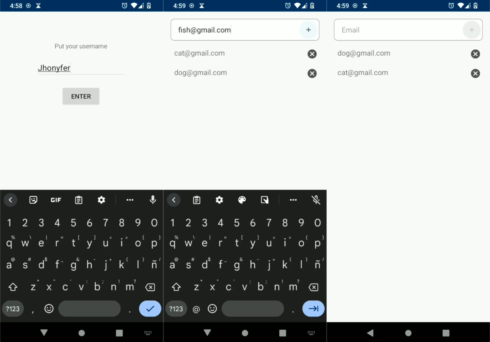

# Room Kotlin Sample - Android
This sample app shows how to use Room, the SQLite database manager for Android.

In this app, you start with an user: then jumps to an activity that allows to
save or delete emails in the local database. Every time you login with a user, the app will show the user emails list.

Room is used as a persistence tool for Android apps. Can manage big amounts of data because uses sqLite. 

## Instructions
1. Clone this repository
2. Build it with Android Studio
3. Install in a Android device and use it

## License
MIT

## About the author
*[Jhonyfer's blog](https://viejony.github.io/blog/en)*